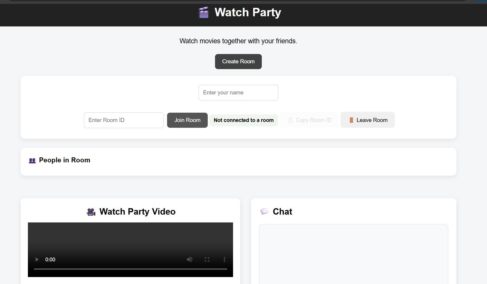
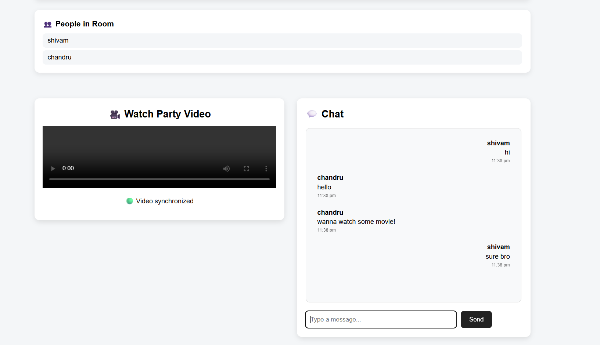
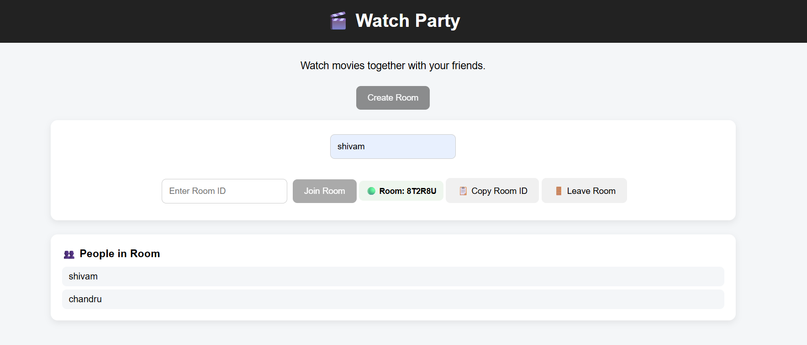

# 🎬 Watch Party

A real-time watch party web application that allows friends to watch a video together, stay synchronized, and chat in real time.

## 🌐 Live Demo

[Open Watch Party](https://watch-party-r2id.onrender.com)


## ✨ Features

- 🏠 Create and join rooms
- 🔑 Unique Room ID generation
- 👤 Username support
- 👥 Real-time member list
- 💬 Real-time chat
- ⌨️ Enter-to-send messages
- ▶️ Synchronized video play/pause
- ⏩ Synchronized video seeking
- 🔄 New users automatically receive the current video state
- 📋 Copy Room ID
- 🚪 Leave Room
- ⚠️ Room validation and error handling
- 📱 Responsive user interface


## 🛠️ Tech Stack

**Frontend**
`HTML` · `CSS` · `JavaScript`

**Backend**
`Node.js` · `Express.js`

**Real-Time**
`Socket.IO`

**Tools**
`VS Code` · `Git` · `GitHub`


## ⚙️ How It Works

1. Create a room or join an existing room using a Room ID.
2. Users enter their names and join the same room.
3. Socket.IO keeps everyone connected in real time.
4. When one user plays, pauses, or seeks the video, the action is shared with the other users.
5. A new user joining the room receives the current video position and playback state.
6. Users can chat with everyone in the room while watching the video together.

## 🏗️ Architecture

```text
User Browser A ──┐
                 │
                 ▼
            Socket.IO
                 │
                 ▼
        Node.js + Express
                 │
                 ▼
          Room Management
                 │
                 ▼
User Browser B ──┘

External Video Host
        │
        ├── Browser A
        └── Browser B
```

## 🚀 Run Locally

```bash
# Clone the repository
git clone https://github.com/codershivaa/Watch-Party.git

# Open the project
cd Watch-Party

# Install dependencies
npm install

# Start the server
node server/server.js
```

Then open:

```text
http://localhost:3000
```

### 🎥 Video Source

The project uses an externally hosted sample video, so the video file is not stored in the GitHub repository.


## 📁 Project Structure

```text
Watch-Party/
├── client/
│   ├── images/
│   │   └── favicon.svg
│   ├── index.html
│   ├── style.css
│   └── script.js
│
├── server/
│   └── server.js
│
├── .gitignore
├── package.json
├── package-lock.json
└── README.md
```

The `client` folder contains the frontend, while the `server` folder contains the Node.js and Socket.IO backend.


## 📸 Screenshots

### 🏠 Room & Video Interface

**

### 💬 Real-Time Chat


*

### 👥 Room Members


*


## 🧠 Technical Details

The application uses **Socket.IO** for real-time communication between users.

### 🎥 Video Synchronization

When a user performs an action such as:

* Play
* Pause
* Seek

the client sends the event to the server through Socket.IO. The server then broadcasts the event to the other users in the same room.

For new users, the current video position and playback state are sent so they can synchronize with the room.

### 💬 Real-Time Chat

Chat messages are sent through Socket.IO and broadcast to everyone in the same room. Each message includes the username, message content, and timestamp.

### 👥 Room Management

Each room has a unique Room ID. Users can create or join rooms, and the server maintains the users currently connected to each room.


## 📚 What I Learned

Building this project helped me understand:

* How a Node.js server works with a frontend application
* How Express.js serves a web application
* How Socket.IO enables real-time communication
* How rooms can be created and managed for multiple users
* How to synchronize actions between different clients
* How to handle client-server events
* How to debug real-time applications
* How to use Git and GitHub for version control


## 🔮 Future Improvements

* 🔗 Add shareable room links
* 🎬 Allow users to add their own video URLs
* 🎙️ Add voice/video communication
* 🔐 Add user authentication
* 💾 Store chat history
* 🎨 Improve the overall UI and user experience
* 📱 Build a dedicated mobile version
* ⚡ Improve synchronization for users with different network speeds


## 👨‍💻 Author

**Shivam Singh**

Built as a learning project to explore real-time web applications, WebSockets, and client-server communication.

---

⭐ If you found this project interesting, feel free to explore the code and experiment with it.
